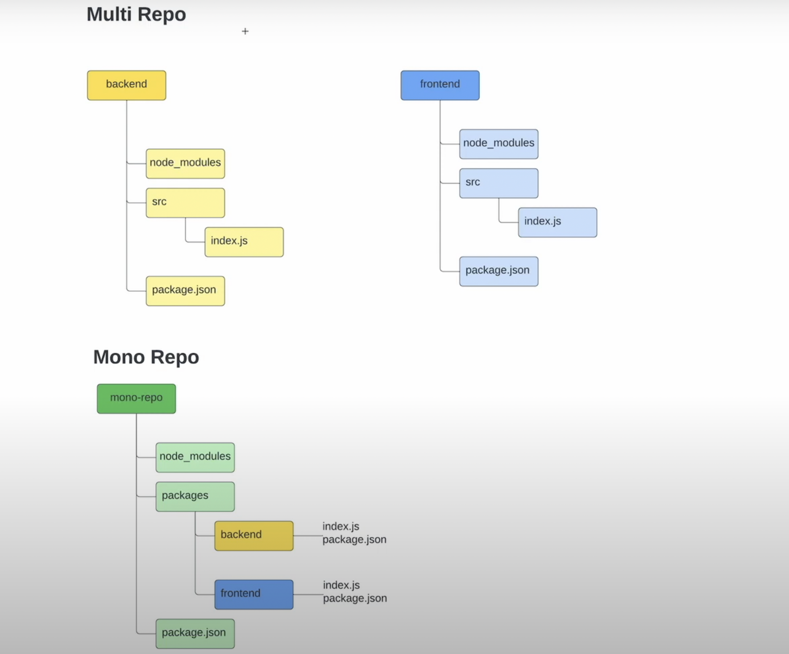

## Monorepo deck

#### Reference code link: [github](https://github.com/ContentPI/site-builder)

#### Preferred yarn setup because npm isn't working properly: [github](https://github.com/benawad/yarn-workspaces-example)

### MonoRepo vs Multi Repo

- reference: [ben-awad-youtube](https://www.youtube.com/watch?v=G8KXFWftCg0)
- Main advantage with monorepo is that you can share packages easily

